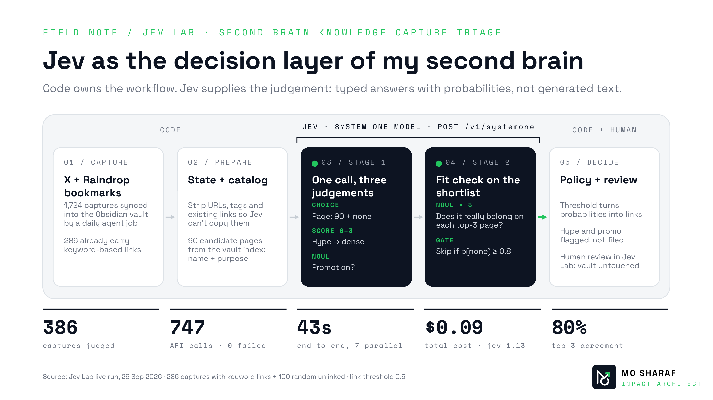
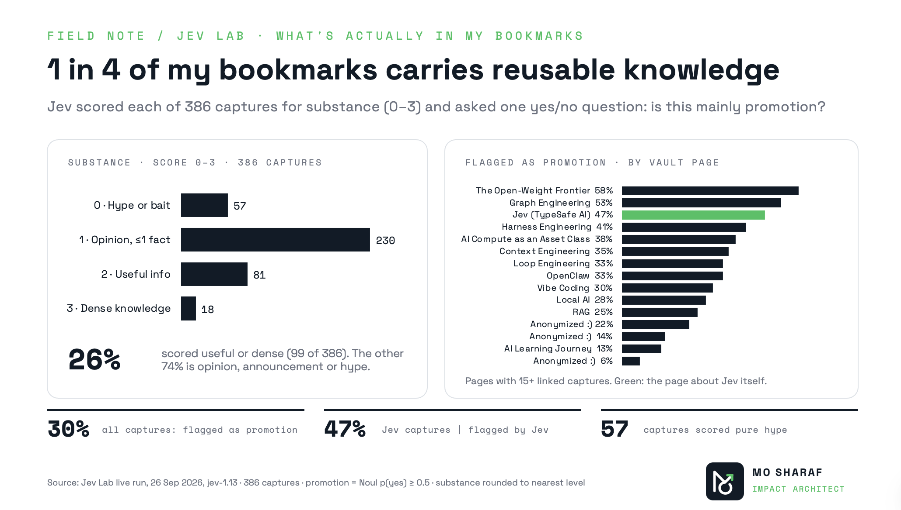
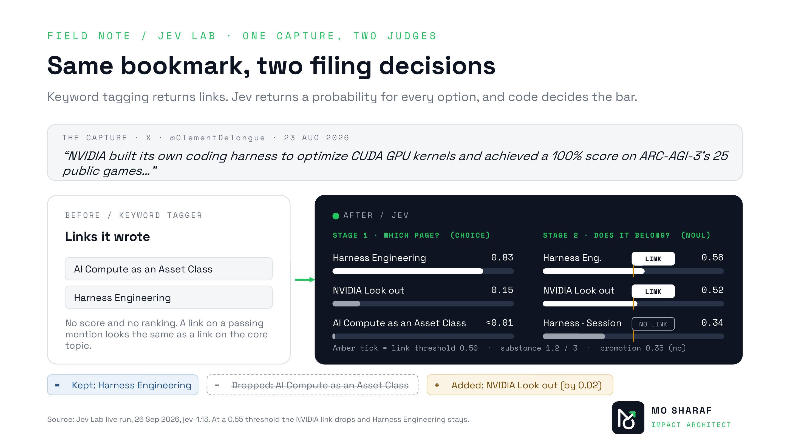
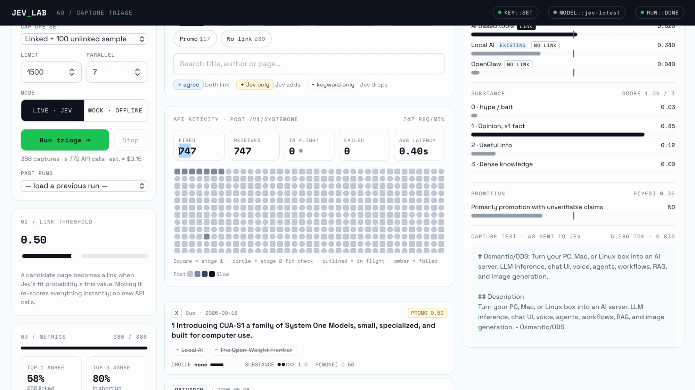

# Jev Lab: capture triage with typed judgements

Jev Lab files the posts and articles you bookmark into your knowledge vault. It uses [Jev](https://docs.typesafe.ai), TypeSafe's System One model, which returns typed answers with probabilities instead of generated text. Your code decides what happens with those answers, and a local web app lets you watch every call and inspect every decision.



## Why

Bookmarking is easy; filing doesn't scale. Keyword tagging over-links, can't tell a passing mention from the core topic, and gives no signal about how sure it is. Jev Lab asks Jev a few narrow questions per capture and keeps the policy (thresholds, what gets filed) in code you control.

## What Jev is asked

| Question | Type | Returns |
|---|---|---|
| Which vault page does this capture belong to? (every page + `none`) | Choice | a probability for each page and a confidence |
| How much reusable knowledge is in it? (0 hype to 3 dense) | Score | a position on the scale |
| Is it mainly promotion with unverifiable claims? | Noul | p(yes) |
| Does it really add to page X? (only the top 3 pages) | Noul × 3 | p(yes) per candidate. At or above the threshold, it becomes a link |

That's at most two API calls per capture. The first three questions share one call; the fit check needs the first call's shortlist, and it's skipped when `none` clearly wins. The pattern comes from TypeSafe's [skill-suggestion cookbook](https://docs.typesafe.ai/cookbooks/skill_suggestion.md).

## Results on my vault

Run of 26 Sep 2026 on `jev-1.13`: 386 captures (286 already carried keyword links, plus 100 random unlinked ones).

- **747 API calls, 0 failed, 43 seconds end to end at 7 in parallel, $0.09 total**, about $0.0002 per capture.
- **80%** of the time, the existing keyword link was in Jev's top 3. Jev was far more conservative: 0.6 links per capture vs 1.5.
- Only **26%** of the bookmarks scored as useful or dense knowledge. **30%** were flagged as promotion, including **47%** of the captures about Jev itself.




Caveats: the keyword links are a baseline, not ground truth. The app shows disagreements in both directions so you can judge who is right. Nothing is written back to the vault; Jev proposes and a person approves.

## Quick start

```bash
git clone https://github.com/msharafh/jev-lab && cd jev-lab
python3 -m pip install -r requirements.txt
python3 app.py            # opens http://127.0.0.1:8765
```

It starts with a **synthetic demo set** (30 made-up captures, an 11-page demo vault) in **Mock** mode, so you can click around with no API key. Mock answers come from word overlap, not from Jev, so treat them as a UI demo only.

For real answers, get a key from [console.typesafe.ai](https://console.typesafe.ai), then either:

```bash
export TYPESAFE_API_KEY=...        # or: cp .env.example .env and paste it there
python3 app.py
```

Select **Live · Jev**, then **Run triage**. On macOS you can also double-click `start.command`.



## Use your own vault

1. **Captures:** put markdown files in `captures/` (subfolders are fine). Each file is a small frontmatter block plus the text:

   ```markdown
   ---
   author: "Jane Doe"
   published: 2026-09-01
   url: "https://…"
   title: "Optional title"
   ---
   The post or article text.

   **Related:** [[Existing Link]]      ← optional; used only for comparison
   ```

   URLs, image links and the `**Related:**` line are stripped before anything is sent to Jev, so it can't copy existing links.

2. **Catalog:** the pages captures can be routed to.

   ```bash
   python3 build_catalog.py "/path/to/your/vault" --exclude-folders Journal Personal
   ```

   It reads an index note (`_index.md` with lines like `- [[Page]] — description`) if you have one. Otherwise every note becomes a page, described by its frontmatter `purpose` or `description`. **Only page names, one-line descriptions and H2 headings go into the catalog. Page bodies are never sent to the API.** Better descriptions give better routing; thin pages attract links.

3. **Optional:** describe your vault in one phrase so Jev has context:
   `export JEV_LAB_VAULT_TOPIC="AI engineering, agents and investing"`.

`captures/` and `catalog.json` are git-ignored. When they exist, the app uses them instead of the demo. You can also point elsewhere with `JEV_LAB_CAPTURES` and `JEV_LAB_CATALOG`.

## The app

- **Run panel:** choose the capture set (linked, unlinked, both or all), a limit, the number of parallel requests, and Live or Mock.
- **API activity:** fired, received, in-flight and failed counters, plus one square per call to `/v1/systemone`. Hover a square for its latency and tokens; click it to open the capture.
- **Threshold slider:** re-scores every link and metric instantly, with no new API calls.
- **Filters:** Agree / Jev only / Keyword only / New links / Promo / No link.
- **Inspect:** stage-1 probabilities, stage-2 fit per candidate against the threshold, substance, promotion, and the exact text sent to Jev.
- **Runs** are saved to `runs/<timestamp>/` (`results.jsonl`, `calls.jsonl`, `meta.json`) and can be reloaded.

The API key stays in the local Python process; the browser never sees it. The app uses only the standard library plus `typesafe-sdk`.

## Command line

```bash
python3 triage.py --mock --limit 20      # offline check
python3 triage.py --set labeled          # agreement with existing links
python3 triage.py --set all --fit 0.55   # everything, stricter links
```

This writes `runs/<timestamp>/report.md` with agreement at several thresholds, proposed new links, substance and promotion breakdowns, and spot-check tables of disagreements.

## Data and cost

Each capture's cleaned text and the catalog (page names, descriptions, headings) are sent to TypeSafe's API. Check [their docs](https://docs.typesafe.ai/models.md) for data handling. At `jev-1.13` pricing ($0.042 per million input tokens, output free), a capture costs about $0.0002.

## Layout

```
app.py            local web app + API proxy (streams per-call events to the page)
triage.py         prompts, two-stage logic, evaluation, CLI, offline mock
build_catalog.py  vault → catalog.json (read-only)
static/           the page (single HTML file) and fonts
demo/             synthetic vault, catalog and captures
docs/             images for this README
```

## Credits

- [TypeSafe](https://typesafe.ai) for Jev, the SDK and the cookbook patterns this builds on.
- Space Grotesk and Space Mono fonts, used under the SIL Open Font License (see `static/fonts/`).

## Licence

MIT © 2026 Mo Sharaf. See [LICENSE](LICENSE).
